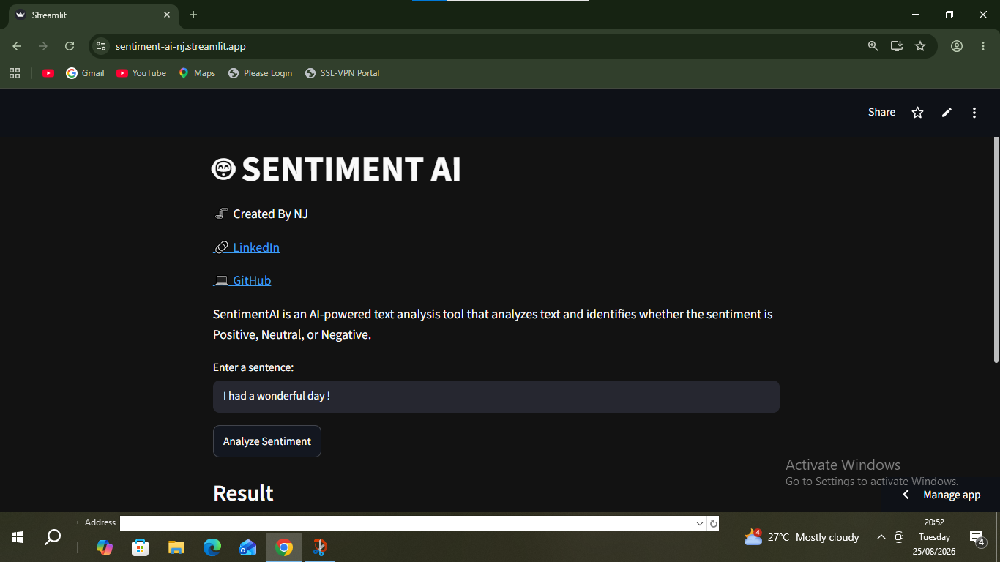
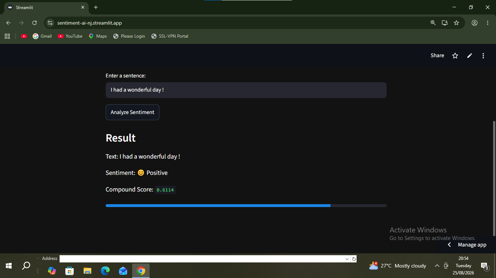

# 🤖 Sentiment AI

A simple AI-powered sentiment analysis web application built with **Python, NLTK, VADER, and Streamlit**.

SentimentAI analyzes user-entered text and classifies it as:

- 😊 Positive
- 😐 Neutral
- 😢 Negative

It also displays the **compound sentiment score** with a visual progress bar.

## 🚀 Live Demo

🔗 **[Try SentimentAI](https://sentiment-ai-nj.streamlit.app/)**

## 📸 Application Preview

### 📊 Sentiment Analysis Result

## ✨ Features

- 📝 Analyze user-entered text
- 🤖 VADER-based sentiment analysis
- 😊 Positive / 😐 Neutral / 😢 Negative classification
- 📊 Compound sentiment score
- 📈 Visual sentiment indicator
- 🌙 Dark-themed interface
- ⚡ Simple and lightweight Streamlit application

## 🛠️ Tech Stack

- **Python**
- **Streamlit**
- **NLTK**
- **VADER Sentiment Analysis**

## 🧠 How It Works

The application uses **VADER (Valence Aware Dictionary and sEntiment Reasoner)** from NLTK to calculate sentiment scores.

The `compound` score ranges from **-1 to +1** and is used to determine the overall sentiment:

| Compound Score | Sentiment |
|---|---|
| `≥ 0.05` | 😊 Positive |
| `-0.05 to 0.05` | 😐 Neutral |
| `≤ -0.05` | 😢 Negative |

## 🔮 Future Improvements

📊 Display individual positive, neutral, and negative scores

📈 Add sentiment analysis history

🎨 Improve the user interface

🧠 Experiment with machine-learning-based sentiment models

🌐 Add more advanced text analysis features

## CREATED BY NJ

## 🌐 Connect With Me

